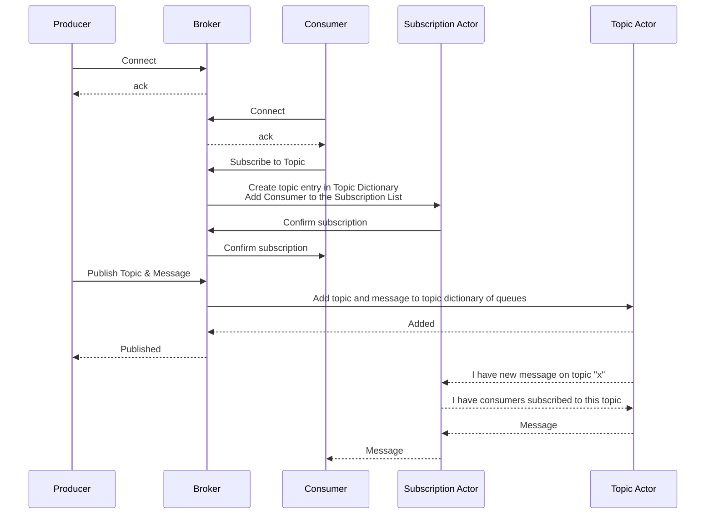
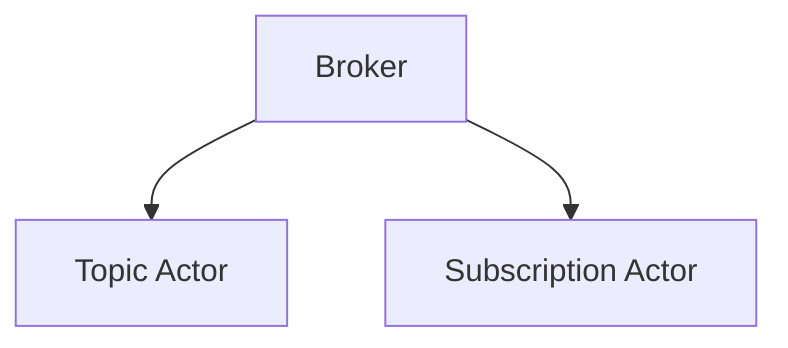

```mermaid
sequenceDiagram
    Producer->> Broker: Connect 
     Broker -->> Producer: ack
    Consumer->> Broker: Connect
     Broker -->> Consumer: ack
    Consumer->> Broker: Subscribe to Topic
    Broker->>Subscription Actor: Create topic entry in Topic Dictionary<br/>Add Consumer to the Subscription List
    Subscription Actor->> Broker: Confirm subscription
    Broker->>Consumer: Confirm subscription
    Producer->> Broker: Publish Topic & Message
    Broker ->> Topic Actor: Add topic and message to topic dictionary of queues
    Topic Actor -->> Broker: Added
    Broker -->> Producer: Published
    Topic Actor -->> Subscription Actor: I have new message on topic "x"
    Subscription Actor -->> Topic Actor: I have consumers subscribed to this topic
    Topic Actor -->> Subscription Actor: Message
     Subscription Actor-->>Consumer: Message 
```

```mermaid
graph 
A[Broker]  --> B[Topic Actor]
A --> C[Subscription Actor]
```